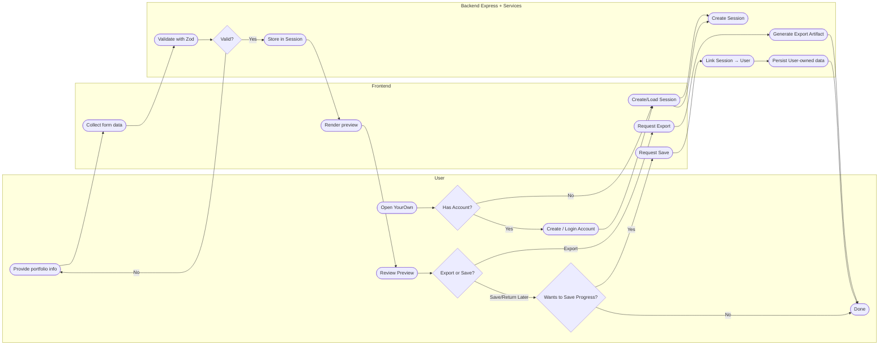
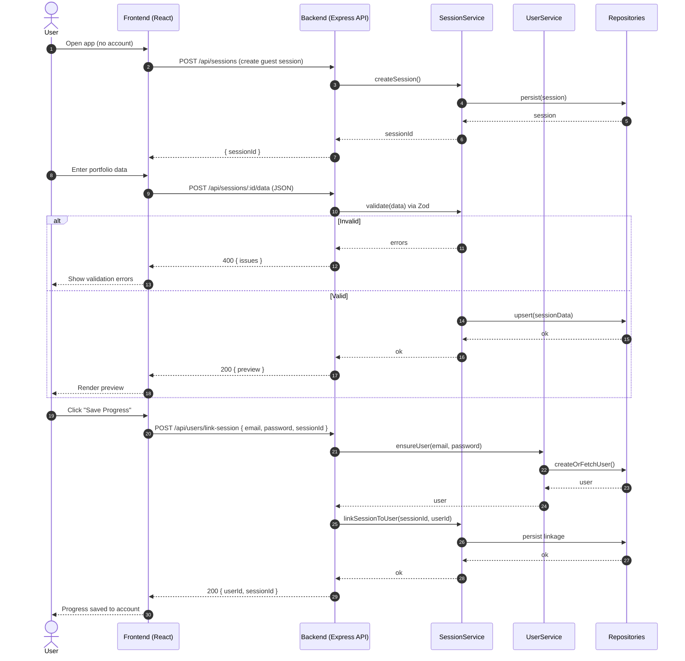
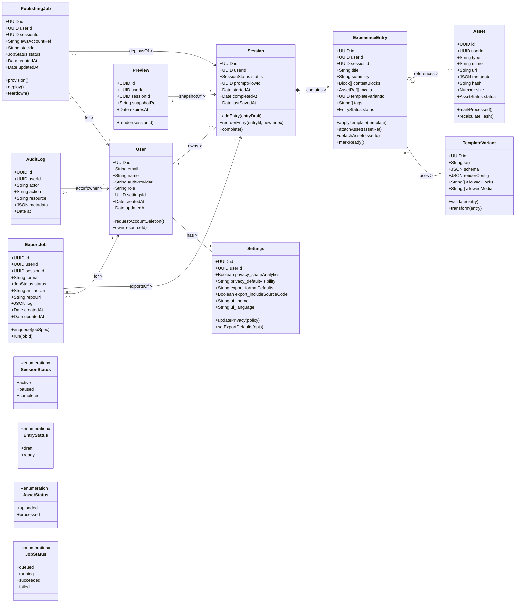

# Project Overview

YourOwn is a platform designed to simplify and enrich the process of building personal portfolios. Unlike existing open-source templates, which often feel tedious to customize, unappealing, and require technical depth, YourOwn emphasizes user experience. When users enter the platform, they are guided through reflection-based questions that help them describe their experience in a structured and meaningful way. Each experience can then be formatted with templates, previewed as part of a full portfolio, and then exported as a ZIP file or Github Repository.

To take a step further, YourOwn provides an optional tool that automatically sets up the user's AWS account with the correct S3 and load balancer configuration, allowing users to host their portfolio on their own cloud domain at minimal to no cost. This removes the barrier of technical setup while keeping true ownership in the hands of the user. There is no vendor lock-in; instead, users walk away with a portfolio they fully control. We only add a subtle watermark to signify it was created through YourOwn.

Our development will follow a plan-driven approach. This is because YourOwn requires building a structured, end to end workflow for user onboarding, portfolio generation, and optional AWS deployment. These sets of components must be carefully designed up front to avoid misalignment and rework. A clear, sequential plan allows us to map each feature and dependent in advance, allowing us to match our intended user experience.

---

# Stakeholders

### Students
**Main Priority:** Find a fast, but easy way to present their skills, abilities, and accomplishments into an elegant and clear portfolio.

**Sub Priorities:**
- The portfolio can be easily updated.
- The portfolio includes advanced options (not just doing the “bare minimum”):  
  Examples: Deeper learning curve in coding the portfolio, option to not let “AI” dictate what you should do, supports more advanced-level code, etc.
- The GUI and UI of the portfolio maker is readable and easy to navigate through.
- Sending links and uploading files to media or others doesn’t cause problems (in other words, it’s straightforward to perform).
- The ability to save others’ portfolios (and see it for future reference).

### Student Organizations
**Main Priority:** Find an efficient method to display information about their organizations.

**Sub Priorities:**
- Easy access to learn more about their organization (i.e., QR-codes, link to website).
- An option to track who visited the website (this allows for the org to get a rough idea who’s interested).

---

# Requirements Elicitation

### How We Will Gather Requirements
To gather requirements for YourOwn, we will use a combination of the following methods:
- **User Interviews:** Conduct one-on-one sessions to understand their needs and frustrations with current portfolio tools.
- **Brainstorming Sessions:** Internal team discussions to explore creative solutions and prioritize features.
- **Competitive Analysis:** Review existing portfolio platforms and open-source templates to identify gaps and opportunities.

### Draft Questionnaire
Here are five sample questions we would ask during interviews or surveys:
1. What challenges have you faced when creating a personal portfolio?
2. How important is visual customization (e.g., templates, layout) in your portfolio?
3. Would you prefer a guided experience or full control when entering your portfolio content? Why?
4. Do you have experience with cloud hosting (e.g., AWS)? Would you use an automated tool to publish your portfolio?
5. What features would make you feel confident that your portfolio truly represents you?

### How We Will Organize Requirements
We will categorize requirements into the following groups:
- **Client-Server Interactions:** Covers user-facing features such as sign-up, dashboard, content input, template selection, and live preview.
- **Exporting Tool:** Includes functionality for generating and downloading the portfolio as a ZIP file or GitHub repository.
- **Automation Tool:** Encompasses the optional AWS deployment tool, including S3 setup, load balancer configuration, and domain routing.

---

# Requirements Specification

## Functional

### FR-01 Sign up & Sign in
**Goal:** The system shall let users create an account to store their progress  
**Acceptance:**
- Users can sign up with email/password or OAuth using third-party accounts (Google preferably)
- Password reset
- After sign in, they land on their dashboard

### FR-02 Create and Manage a Portfolio Project
**Goal:** The system shall allow to start a portfolio, rename it, and delete it  
**Acceptance:**
- “New portfolio” button creates a blank project
- Users can rename or delete a project from the dashboard
- Multiple Portfolios won't be in MVP but to be considered
- Multiple portfolios could be a premium

### FR-03 Dashboard page
**Goal:** Shows all necessary items in this dashboard page.  
**Acceptance:**
- “New Portfolio” button to create a blank project.
- Show Portfolio (After MVP, we will show all portfolios. MVP will only support 1 per user) and have an edit and delete button for portfolios.
- 1-2 minute click through tutorial for new users
- Settings page to update/change personal information

### FR-04 Add Experiences (Content input)
**Goal:** CRUD experience entries (role, org, dates, bullets, etc.)  
**Acceptance:**
- Form lets users add multiple experiences
- Users can reorder experience
- Drag and drop (?)
- Changes are saved automatically

### FR-05 YourOwn watermark
**Goal:** Create a paywall for removing our watermark  
**Acceptance:**
- Watermark stays in a discreet area of the portfolio to advertise YourOwn
- Users can pay to remove the watermark

### FR-0 Upload Media
**Goal:** Add project images and profile photos  
**Acceptance:**
- Users can upload images from their device
- Large or unsupported file show a friendly error

### FR-0 Upload links
**Goal:** Users are allowed to upload links of their socials and any other external sites  
**Acceptance:**
- Links are embedded in assets for better UI
- Users can CRUD links after portfolio is done
- Their local dev allows them to do that

### FR-05 Choose a template for experience
**Goal:** The system shall allow user to pick 1-2 templates  
**Acceptance:**
- Template picker shows screenshots
- Selected template updates the preview

### FR-06 Live Preview
**Goal:** The system shall show how portfolio will look like without delivering full code  
**Acceptance:**
- Preview shows at the end of process
- Preview shows correct content with template

### FR-07 Export a ZIP
**Goal:** The system shall allow user to download a working website (HTML/CSS/Assets) as a zip  
**Acceptance:**
- “Export” Creates a downloadable zip

### FR-08 Automate publishing template in AWS
**Goal:** The system shall have a tool to setup a users aws account to publish portfolio  
**Acceptance:**
- Tool should be optional for users
- No security issues handling users aws account
- Successfully adds S3 configs
- Successfully adds ELB configs
- Successfully adds route 66 configs for domain name

---

## Non-Functional

### NFR-01 Easy Sign-Up
**Intent:** Keep account creation painless.  
**Acceptance:**
- Sign-up takes ≤ 1 minute for a new user.
- No more than 2 screens (email/password → confirm).
- Clear reasons shown if sign-up fails.

### NFR-02 Clarity & Simplicity in experience creation
**Intent:** Adding an experience should feel natural.  
**Acceptance:**
- Plain language labels (no jargon).
- Each screen has one clear primary
- No part of the process should feel unnecessary to the user
- First-time users can create a portfolio and add one experience in ≤ 10 minutes.

### NFR-03 Responsiveness (Perceived Speed)
**Intent:** Feels snappy on normal internet.  
**Acceptance:**
- Preview updates within ~½ second after an edit.
- Export completes within a short, reasonable time for small portfolios (e.g., under ~10 seconds).
- Loading states or progress bars appear when needed.

---

# Requirements Validation

We will validate requirements through building wireframes and mock workflows to check usability and getting feedback from early users.

## Functional Requirements

### FR-01: Sign up & Sign in
- **Verifiability:** Yes, can test by creating accounts, logging in, resetting passwords.
- **Comprehensibility:** Clear—requirements specify flows and outcomes.
- **Traceability:** Originates from core need to give users individual experience and have info for analytics.
- **Adaptability:** Can add more sign-in methods or 2FA later.

### FR-02: Create and Manage a Portfolio Project
- **Verifiability:** Test with new, rename, delete actions.
- **Comprehensibility:** Straightforward, includes MVP scope.
- **Traceability:** Comes from user’s need to manage their created portfolios.
- **Adaptability:** Scales to multiple portfolios or premium tier.

### FR-03: Dashboard page
- **Verifiability:** Test visibility of portfolio items, tutorial, settings.
- **Comprehensibility:** Clear features listed.
- **Traceability:** Core usability needs.
- **Adaptability:** Dashboard can evolve to support new features.

### FR-04: Add Experiences (Content input)
- **Verifiability:** Test CRUD operations and reordering.
- **Comprehensibility:** Explicit fields and actions make it clear.
- **Traceability:** Derived from portfolio content creation needs.
- **Adaptability:** Can extend with richer input types later.

### FR-05: YourOwn watermark
- **Verifiability:** Can test watermark visibility and payment removal.
- **Comprehensibility:** Clear paywall logic.
- **Traceability:** Businesses need to monetize.
- **Adaptability:** Could expand to subscription tiers.

### FR-0: Upload Media
- **Verifiability:** Test file upload success and error cases.
- **Comprehensibility:** Clear acceptance criteria.
- **Traceability:** From user need for visuals.
- **Adaptability:** Extendable to video or cloud integrations.

### FR-0: Upload Links
- **Verifiability:** Test CRUD links and embedding.
- **Comprehensibility:** Clear.
- **Traceability:** From need to show external presence.
- **Adaptability:** Could support custom icons or analytics.

### FR-05: Choose a template
- **Verifiability:** Test template selection and preview change.
- **Comprehensibility:** Clear and simple.
- **Traceability:** From design customization needs.
- **Adaptability:** Can add more templates later.

### FR-06: Live Preview
- **Verifiability:** Test preview correctness and responsiveness.
- **Comprehensibility:** Clear “without delivering full code.”
- **Traceability:** From user need for feedback before publishing.
- **Adaptability:** Could expand to real-time previews.

### FR-07: Export a ZIP
- **Verifiability:** Test by downloading and running the portfolio.
- **Comprehensibility:** Straightforward.
- **Traceability:** From requirement for usable output.
- **Adaptability:** Could support GitHub Pages or Netlify export.

### FR-08: Automate publishing template in AWS
- **Verifiability:** Test AWS setup success (S3, ELB, Route 66).
- **Comprehensibility:** Some complexity, but clear.
- **Traceability:** From deployment convenience goal.
- **Adaptability:** Could later add support for Azure or GCP.

---

## Non-Functional Requirements

### NFR-01: Easy Sign-Up
- **Verifiability:** Test sign-up duration and failure messages.
- **Comprehensibility:** Clear time and step limits.
- **Traceability:** From core UX design goals.
- **Adaptability:** Can be adjusted for new flows like social login.

### NFR-02: Clarity & Simplicity in Experience Creation
- **Verifiability:** Usability testing, measuring time to add experience.
- **Comprehensibility:** Clear plain-language requirement.
- **Traceability:** From UX needs.
- **Adaptability:** Can be refined based on user testing feedback.

### NFR-03: Responsiveness (Perceived Speed)
- **Verifiability:** Test preview delay and export duration.
- **Comprehensibility:** Clear quantitative measures.
- **Traceability:** From performance goals.
- **Adaptability:** Benchmarks can be adjusted as portfolio sizes grow.

---
title: Process Model — YourOwn (Guest Session → Optional Account)
---

  This workflow emphasizes a frictionless guest experience: a user can create a portfolio without registering. The Session object captures form inputs and preview state while the user remains anonymous. Validation runs on each submit cycle and feeds back to the client for quick correction.
When the user wants to export or save progress, the system branches. Export proceeds directly using the Session, while saving requires linking the Session to a User (new or existing). At that point, Session data is persisted under the user account, preserving continuity for future edits.

---
title: Behavioral Model
---

The Session begins in Active upon creation and cycles between Active and Error based on validation outcomes. If the user goes idle or navigates away, the Session may become Paused and later Resumed. The Session enters Completed when the user exports a portfolio or links the Session to their account and saves. Modeling behavior at this level clarifies edge cases (timeouts, retries) and ensures the API supports resuming work without data loss.

---
title: Class diagram 
---

Each class is separated in such a way to allign the export without account structure. the session holds the experiance from user while the user remains a guest. Those entries can later be lined to a User upone account creation or login. TemplateVariant will conatin how each entry should render. ExportJob and Publishjob are asynchrnous model operations that will assits user in getting and publishing porfolio.

Requirement 1: NFR-01 – Easy Sign-Up
Design Decision:
 Implement an OAuth 2.0-based authentication system with support for social logins (e.g., Google, Apple) and client-side form validation before submission.
Justification:
 Using OAuth reduces the number of steps a user must take during sign-up, improving both speed and reliability. Client-side validation ensures that users receive immediate feedback on incorrect inputs, minimizing frustration and failed attempts. Together, these design choices align with the system’s goal of making the sign-up process fast, smooth, and easily adaptable to new authentication flows in the future.

Requirement 2: NFR-03 – Responsiveness (Perceived Speed)
Design Decision:
 Introduce client-side caching for static assets and asynchronous background processing for heavy tasks like experience preview generation or export.
Justification:
 Client-side caching reduces load times by reusing previously downloaded resources, while background task processing ensures that long-running operations don’t block the main interface. These approaches improve the system’s perceived speed and maintain responsiveness, even as user-generated content or portfolio sizes increase over time.

5:
Logical view:

This view shows the core modules of YourOwn. Users interact through the UI, which guides them through the Experience Builder. Their input is used by the Portfolio Generator to create a structured portfolio. The Export Manager handles output formats, and the AWS Deployment Module optionally sets up hosting.
2. Process view:

At runtime, the user begins by entering information via the UI. The system processes this through the Experience Builder, then generates a portfolio. The user can export it or deploy it to AWS. Each module interacts with external services (GitHub, AWS) as needed.

6: Use of architectural patterns (client-server):

We went with a client-server based architectural pattern because naturally, the features we implement splits into a rich, guided web client (reflection flow, template selection, live preview) and a server that owns portfolio generation, export, auth, and the optional AWS automation.

How this would work for YourOwn is it maps like this:
Client (Browser/App): Onboarding wizard, content forms, drag-and-drop reorder, template picker, live preview.
Internet: Auth (email/OAuth), experience CRUD, preview rendering, ZIP/GitHub export, watermark/paywall, AWS deployer (S3 + ALB + Route 53* automation).
Server (API): DB for user/projects/assets, object storage for uploaded images, GitHub API, AWS APIs.

One strength (for YourOwn):
Clear separation of concerns and deploy boundaries → helps you validate NFR-02 Clarity and NFR-03 Responsiveness independently (e.g., client perf vs. server perf). It also simplifies security (tokens, roles) for FR-01.

One limitation (and mitigation):
Network round-trips can hurt preview snappiness.
Mitigate with: optimistic UI updates, client caching, and batched endpoints for preview; push pre-rendered diffs rather than full HTML when possible.

